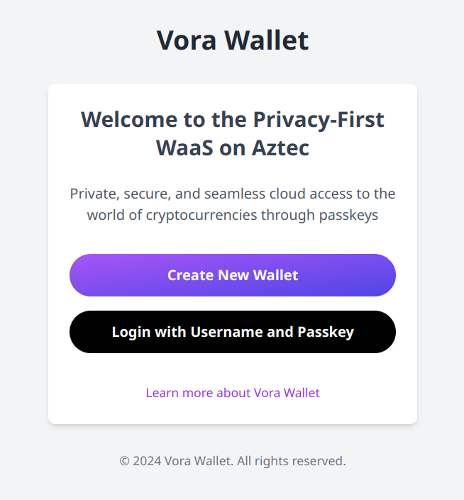

# Vora Wallet

Vora Wallet is envisioned as a Wallet as a Service (WaaS) platform built on the [Aztec](https://aztec.network/) L2 blockchain. It leverages a Private Execution Environment (PXE) run in the cloud by the Wallet Provider, allowing users to securely access their individual wallets using passkeys.



## Table of Contents

- [Overview](#overview)
- [Features](#features)
- [Technology Stack](#technology-stack)
- [Prerequisites](#prerequisites)
- [Installation](#installation)
- [Configuration](#configuration)
- [Running the Project](#running-the-project)
- [Usage](#usage)
- [Contributing](#contributing)
- [License](#license)

## Overview

Vora Wallet utilizes the [FIDO2](https://fidoalliance.org/fido2/) standard for authentication, enabling users to sign in using various methods:

- TouchID on iPhones
- Fingerprint verification on Android devices
- Pattern recognition on Android devices
- Hardware USB keys like [YubiKey](https://www.yubico.com/)
- Any other [WebAuthn](https://webauthn.guide/) compliant device

The PXE service runs on the server and utilizes user-scoped sessions for enhanced security.

## Features

- Secure authentication using passkeys (FIDO2/WebAuthn)
- Cloud-based Private Execution Environment
- User-scoped sessions for improved security
- Compatible with various authentication methods and devices

## Technology Stack

- [NestJS](https://nestjs.com/): A progressive Node.js framework for building efficient and scalable server-side applications
- [HTMX](https://htmx.org/): A lightweight JavaScript library for AJAX, CSS Transitions, and WebSockets
- [Tailwind CSS](https://tailwindcss.com/): A utility-first CSS framework for rapidly building custom user interfaces
- [PostgreSQL](https://www.postgresql.org/) using [Supabase](https://supabase.com/): An open-source Firebase alternative
- [SimpleWebAuthn](https://simplewebauthn.dev/): A WebAuthn library for Node.js and browsers

## Prerequisites

Before you begin, ensure you have met the following requirements:

- Node.js and npm installed
- [Aztec Sandbox](https://docs.aztec.network/guides/developer_guides/getting_started/quickstart) version 0.53.0 running locally, or access to a remote sandbox
- A passkey-compatible device (iPhone, Android device) or access to the WebAuthn emulator on Google Chrome
- Git installed on your local machine

## Installation

1. Clone the repository:
   ```
   git clone https://github.com/your-username/vora-wallet.git
   ```

2. Navigate to the project directory:
   ```
   cd vora-wallet
   ```

3. Install dependencies:
   ```
   npm install
   ```

## Configuration

1. Create a `.env` file in the root directory of the project.

2. Add the following environment variables to the `.env` file:

   ```
   DATABASE_HOST=
   DATABASE_PORT=
   DATABASE_USERNAME=
   DATABASE_PASSWORD=
   DATABASE_NAME=
   RP_NAME='Vora Wallet'
   RP_ID='localhost'
   ORIGIN='http://localhost:3000'
   PXE_URL=
   SESSION_SECRET=
   ```

3. Fill in the empty fields with your specific configuration details.

   Note: If you're using a remote Aztec sandbox, set the `PXE_URL` accordingly.

## Running the Project

To start the Vora Wallet application, run the following command:

```
npm start
```

The application should now be running and accessible at `http://localhost:3000` (or the port specified in your configuration).


---

For more information on the technologies used in this project, please refer to their official documentation:

- [Aztec Network Documentation](https://docs.aztec.network/)
- [FIDO2 Specification](https://fidoalliance.org/specifications/download/)
- [WebAuthn Guide](https://webauthn.guide/)
- [PostgreSQL Documentation](https://www.postgresql.org/docs/)
- [Supabase Documentation](https://supabase.com/docs)
- [NestJS Documentation](https://docs.nestjs.com/)
- [HTMX Documentation](https://htmx.org/docs/)
- [Tailwind CSS Documentation](https://tailwindcss.com/docs)
- [SimpleWebAuthn Documentation](https://simplewebauthn.dev/docs/)